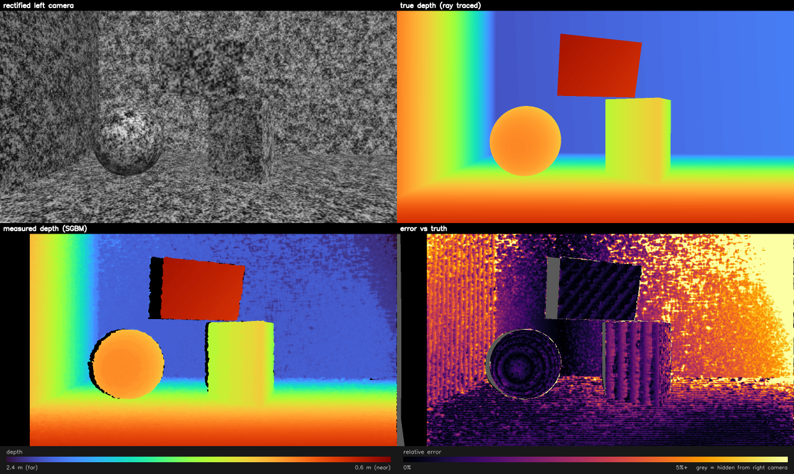
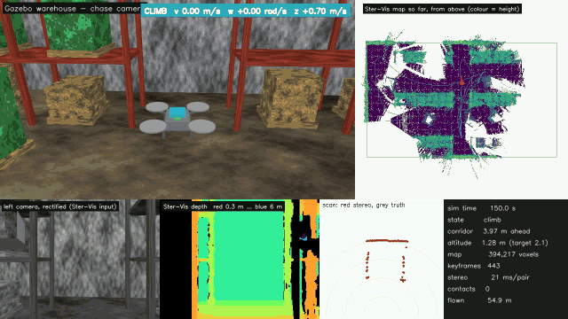
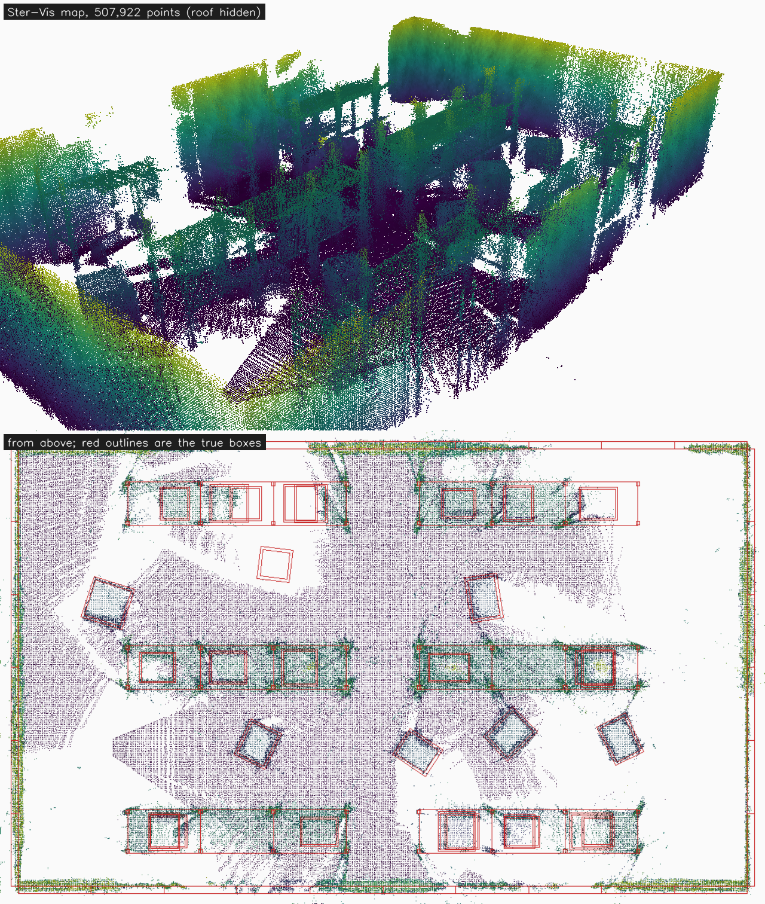

# Ster-Vis

[](https://github.com/vixhvajit/Ster-Vis/actions/workflows/ci.yml)
[](https://github.com/vixhvajit/Ster-Vis/releases/latest)
[](LICENSE)

Depth from a pair of cameras: calibrate the rig, rectify the views, match them,
and read distance out of the disparity. On a robot it gives the outputs a
commercial depth camera does, over ROS 2 or plain HTTP, and fuses the frames
into one point cloud map of wherever it has been.



*The full pipeline on a ray-traced test scene: calibrated from rendered
chessboards, then matched with SGBM. 93% of the visible pixels get a depth,
with a median error of 1.6%. See [Try it without cameras](#try-it-without-cameras).*

## How it works

Two cameras looking at the same scene see each point at slightly different
horizontal positions. That offset is the **disparity**, and once the rig is
calibrated it converts straight to distance:

```
Z = f * B / d
```

where `f` is the rectified focal length in pixels, `B` the baseline between the
camera centres, and `d` the disparity in pixels. Near things shift a lot, far
things barely shift, and a point at infinity has zero disparity.

Matching is only cheap because of **rectification**: the two images are warped
so that corresponding points always land on the same image row, which turns the
search from two-dimensional into a scan along one line.

## Layout

```
src/stereo_vision/
  cli/               the ster-vis command, one module per subcommand
  viewer.html        the browser viewer, shipped inside the package
  config.py          BoardSpec and SGBMParams
  capture.py         save and load calibration pairs
  calibration.py     corner detection, stereo solve, frame coverage, rectification
  disparity.py       StereoSGBM matcher, optional WLS filter, colorizing
  depth.py           disparity to depth, depth files, point cloud, PLY export
  pattern.py         chessboard target as a true-scale PDF or a raster
  presets.py         named speed/accuracy trade-offs
  sources.py         USB and Pi camera capture, threaded, with frame sync
  live.py            per-frame depth pipeline with stage timings
  stream.py          live view and robot HTTP API (/api/v1/...)
  outputs.py         robot outputs: metres, point cloud, laser scan, obstacles
  mapping.py         fuses per-frame clouds into one map, at poses you supply
  ros2.py            ROS 2 publisher: standard sensor_msgs topics and TF
  autocapture.py     saves calibration pairs without a key press
  benchmark.py       frame rate per preset, and accuracy against truth
  synthetic.py       virtual stereo rig that photographs the chessboard
  scene.py           ray-traced 3D scene with exact per-pixel depth
deploy/pi/            installer, systemd service and settings for a Raspberry Pi
tools/               release tooling (release notes from the changelog)
examples/            robot client for the HTTP API
docs/                printable targets; docs/samples holds example outputs
tests/               runs without hardware
sim/gazebo/          Gazebo simulations (not part of the package): a rover avoiding
                     obstacles, and a drone mapping an indoor warehouse
```

## Hardware

Two cameras, ideally the same model, bolted to one rigid bar and pointing the
same way. The spacing between them, the **baseline**, is your choice. Nothing
in the code assumes a value, because calibration measures it. Recalibrate
whenever you change it.

A wider baseline makes far objects more precise but pushes the closest
measurable distance further out:

| Baseline | Closest usable distance | Depth error at 2 m |
|---|---|---|
| 3 cm | 16 cm | ±4.8 cm |
| 6 cm | 33 cm | ±2.4 cm |
| 12 cm | 66 cm | ±1.2 cm |
| 20 cm | 1.1 m | ±0.7 cm |

These numbers assume a 700 px focal length, 128 disparities and quarter-pixel
matching accuracy. They follow from:

```
closest distance = f * B / num_disparities
depth error      = Z^2 * 0.25 / (f * B)
```

The error grows with the square of distance, so doubling range costs four
times the precision. Choose the baseline for the distance you care about most.
Around 6 cm suits a desk or arm's length, 12-20 cm suits a room or a robot
looking several metres ahead. You can also get closer by raising
`--num-disparities`, though matching slows down.

The table covers matching error only. In practice calibration error adds to it
and dominates at long range; see [what the synthetic scene shows](#what-the-synthetic-scene-shows).

## Install

Python 3.11 or newer. Into a virtual environment:

```powershell
pip install "ster-vis @ git+https://github.com/vixhvajit/Ster-Vis"
ster-vis --version
```

That installs the `ster-vis` command:

| Command | Does |
|---|---|
| `ster-vis chessboard` | write a printable calibration target (PDF) |
| `ster-vis capture` | capture calibration pairs; `--auto` for a headless Pi |
| `ster-vis calibrate` | solve the rig from captured pairs |
| `ster-vis depth` | depth from two images, or live; `--stream` also serves the robot API |
| `ster-vis ros2` | run as a ROS 2 node: depth, point cloud, laser scan, TF |
| `ster-vis view` | inspect a depth map: hover for mm, click to measure |
| `ster-vis viewer` | open the browser viewer for point clouds and depth maps |
| `ster-vis benchmark` | frame rate per preset on this machine |
| `ster-vis doctor` | check an install: versions, cameras, calibration, throttling |
| `ster-vis upgrade` | check for, verify and install another release (`--check`, `--to 2.0.0`) |
| `ster-vis check`, `ster-vis scene` | try the pipeline on synthetic data with known truth |

Each takes `--help`. Output files (calibration, depth maps) are written
relative to the folder you run in. The optional extra `ster-vis[viewer]` adds
Open3D for 3D point cloud windows.

**To work on the code**, clone it and install it editable, with the test tools:

```powershell
git clone https://github.com/vixhvajit/Ster-Vis.git
cd Ster-Vis
python -m venv .venv
.venv\Scripts\activate        # Linux/macOS: source .venv/bin/activate
pip install -e ".[dev]"
python -m pytest
```

`opencv-contrib-python` is used rather than the base package because the WLS
disparity filter lives in the contrib `ximgproc` module.

### Versions and upgrades

Ster-Vis uses [semantic versioning](https://semver.org/): patch releases
(`2.0.x`) only fix bugs, minor releases (`2.x.0`) add features without
breaking anything, and only major releases (`x.0.0`) can change something you
rely on. The promise covers the CLI, the HTTP API, ROS topics and file
formats. Every change is in the [changelog](CHANGELOG.md).

```bash
ster-vis upgrade --check      # is there a newer release?
ster-vis upgrade              # verify its checksum, then install it
ster-vis upgrade --to 0.1.0   # install a specific version, e.g. to roll back
```

Calibrations from older versions keep working. [docs/RELEASING.md](docs/RELEASING.md)
covers the full policy, which versions get fixes, upgrading a deployed Pi, and
how releases and patches are made. Report bugs with the issue template; it
asks for `ster-vis doctor` output.

## Usage

### 0. Print the calibration target

A ready-made board matches the script defaults of 9x6 inner corners and 25 mm
squares:

- **[chessboard_9x6_25mm_a4.pdf](docs/chessboard_9x6_25mm_a4.pdf)** for A4
- **[chessboard_9x6_25mm_letter.pdf](docs/chessboard_9x6_25mm_letter.pdf)** for US Letter

When printing:

1. Set the scale to **100% / Actual size** and turn off "Fit to page". Fitting
   the page shrinks the squares, and every depth reading comes out scaled by
   the same factor.
2. Check the 100 mm scale bar with a ruler, then measure one square. If it
   isn't exactly 25.0 mm, pass the measured value to `--square-size`.
3. Glue it flat to foam board, acrylic or stiff cardboard. A board that bends
   ruins the calibration.
4. Matte paper is better than glossy, because glare hides corners.

For another size or paper, generate one:

```powershell
ster-vis chessboard --columns 9 --rows 6 --square-mm 20 --paper letter
```

Bigger squares are easier to detect from far away. If the board doesn't fit
the page, the script tells you so.

### 1. Capture calibration pairs

```powershell
ster-vis capture --left-index 0 --right-index 1 --columns 9 --rows 6
```

SPACE saves a pair, Q quits. `--columns` and `--rows` count **inner corners**,
so a board of 10x7 squares is `--columns 9 --rows 6`.

A grid over each view turns green where saved pairs have put board corners.
**Keep capturing until nearly all of it is green in both views**, about 25
pairs, tilted and at several distances. The corners and edges of the frame
matter most.

This is the step that decides whether depth near the edges is any good. The
lens model is only trustworthy where the board has been. In the synthetic
tests, boards bunched in the centre covered 42% of the frame and left edge
pixels **15.8 px** off after rectification. Boards spread to the edges covered
78% and cut that to 1.2 px.

### 2. Calibrate

```powershell
ster-vis calibrate --square-size 25 --preview output/rectified.png
```

`--square-size` sets the unit for everything downstream: pass millimetres and
depth comes out in millimetres. The preview draws horizontal rules over a
rectified pair — the same feature should sit on the same rule in both halves.

Two numbers to check:

- **Reprojection RMS**: under about 0.5 px is good, over 1.0 px means recapturing.
- **Frame coverage**: aim for 75% or more. The script warns below 65%.

**A low RMS does not mean a good calibration.** RMS only measures the fit
where the boards were. The badly centred calibration above reported a *better*
RMS (0.19 px) than the well spread one (0.23 px), while being thirteen times
worse at the edges. Coverage is the number that catches this.

Even a well-spread calibration measures the baseline only so precisely. With
20–25 pairs, the synthetic tests put it about 0.5% off on average, and up to
1% on unlucky sets. That error scales every depth reading by the same amount.
More pairs, and a board whose square size you measured carefully, tighten it.

### 3. Disparity and depth

```powershell
ster-vis depth --left data/pairs/left/000.png --right data/pairs/right/000.png --depth-out output/depth.png --ply output/cloud.ply
```

That writes:

| File | What it is |
|---|---|
| `output/depth.png` | depth map, 16-bit PNG in millimetres, 0 = no depth |
| `output/depth_color.png` | the same, coloured for a quick look |
| `output/cloud.ply` | 3D point cloud with the image's colours |

Use `--depth-out output/depth.npy` for float32 millimetres instead. The 16-bit
PNG is the format RealSense, Kinect and most RGB-D datasets use, so other
tools read it too.

Or live, from the cameras:

```powershell
ster-vis depth --live --preset balanced
```

`--preset` trades accuracy for speed (see [Presets](#presets)), and
`--min-distance` sets the closest distance to measure, in the calibration's
units. A larger minimum distance is faster.

## Raspberry Pi 5

Ster-Vis runs on a Pi 5 as a self-contained depth camera, with or without a
display. What's tuned for it:

- **Presets that rectify straight to a smaller image.** Half resolution does
  about an eighth of the matching work, with no extra resize step.
- **Pi camera modules through Picamera2**, including both connectors on the
  Pi 5. The greyscale image comes straight from the camera's YUV output, with
  no colour conversion per frame.
- **Frame synchronisation.** Where libcamera supports it, Raspberry Pi's
  software camera sync makes the two cameras expose together; Raspberry Pi
  documents the result as within "several tens of microseconds". Where it
  doesn't, pairs are matched by sensor timestamp to within half a frame. Each
  frame reports its skew either way.
- **Locked focus.** Camera Module 3's autofocus would change the focal length
  and quietly invalidate the calibration, so focus is fixed (`--focus`, in
  dioptres: 1.0 focuses at 1 m).
- **Capture on its own thread**, so the cameras deliver the next pair while
  the current one is matched.
- **Headless operation:** the live view streams to any browser, depth maps
  save on a timer, and calibration pairs capture themselves without a key
  press.
- **A benchmark** that measures real frame rates on the Pi and checks for
  thermal throttling.

### Hardware

- Raspberry Pi 5 with the **Active Cooler**. Stereo matching keeps all four
  cores busy, and without cooling the Pi throttles, so the frame rate drops
  after a minute or two. The benchmark reports whether this happened.
- The **27 W USB-C power supply**, which is Raspberry Pi's recommendation for
  the Pi 5.
- **Two identical camera modules** on the two camera connectors, bolted to one
  rigid bar. Two USB webcams also work (`--backend opencv`). If they share a
  USB bus, add `--fourcc MJPG`, because two uncompressed 720p streams can
  exceed what one bus carries.

### Setup

On Raspberry Pi OS (current release, based on Debian Trixie):

```bash
sudo apt update && sudo apt full-upgrade -y
sudo apt install -y python3-picamera2        # already installed except on Lite
rpicam-hello --list-cameras                  # should list two cameras

git clone https://github.com/vixhvajit/Ster-Vis.git
cd Ster-Vis
python3 -m venv --system-site-packages .venv # lets the venv see picamera2
source .venv/bin/activate
pip install .
ster-vis doctor --cameras
```

Picamera2 comes from apt rather than pip, as Raspberry Pi recommends: apt
guarantees a matching libcamera. `--system-site-packages` makes it visible
inside the virtual environment. `ster-vis doctor --cameras` checks the whole
setup and says how to fix anything missing.

**On the older Bookworm release**, install with
`pip install -c constraints-numpy1.txt .` instead. Bookworm's picamera2 is
built against numpy 1.24, and current OpenCV needs numpy 2, which can break
it. The constraints file pins the last OpenCV that works with numpy 1. CI
tests both stacks on ARM64.

To run the Pi as a depth camera that starts at boot, see
[Deploy on a Raspberry Pi](#deploy-on-a-raspberry-pi).

`full-upgrade` also brings a libcamera new enough for software camera sync.
Without it, capture falls back to timestamp pairing and tells you so.

### Headless workflow

Everything below works over SSH, watching from a laptop's browser.

**1. Capture calibration pairs.** Print the board, then:

```bash
ster-vis capture --auto --headless --stream 8080 --width 1280 --height 720
```

Open the printed address (`http://<pi-name>.local:8080/`) on your laptop.
Hold the board still for about half a second in each new position. A pair
saves by itself when the board is still, visible to both cameras, and either
reaches uncovered parts of the frame or sits clearly apart from earlier
poses. Capture stops at 25 pairs and 75% coverage.

**2. Calibrate:**

```bash
ster-vis calibrate --square-size 25
```

**3. Measure your Pi's speed:**

```bash
ster-vis benchmark --threads 1,2,4
```

This prints a table of frame rate per preset and thread count, and warns if
the Pi throttled during the run. The first run ray traces a test frame, which
takes a while on a Pi; it is cached for later runs. Add `--live` to time your
real cameras with your calibration.

**4. Run live:**

```bash
ster-vis depth --live --preset pi5 --headless --stream 8080 --save-dir output/live
```

The browser shows the camera image beside colour-coded depth, with the frame
rate and camera skew. A depth map saves to `output/live/` every second
(`--save-every`), and opens in the [viewers](#viewing-results).

Keep `--width`, `--height` and `--focus` the same for capture and live runs. A
calibration only holds for the resolution and focus it was made at, and the
live script refuses frames of the wrong size.

The stream has no password. Anyone on the same network can open it.

### Presets

| Preset | Rectified size (from 1280×720) | Matching work | Filled | Error 0.6–1 m | Error 1.2–2 m | Error 2.2–3 m |
|---|---|---|---|---|---|---|
| `quality` | 1280×720 | 100% | 93% | 0.44% | 1.79% | 3.99% |
| `balanced` | 960×540 | 37% | 94% | 0.53% | 2.15% | 3.77% |
| `pi5` | 640×360 | 13% | 93% | 0.71% | 2.35% | 4.33% |
| `pi5-fast` | 480×270 | 5% | 94% | 0.71% | 1.75% | 5.25% |
| `pi5-bm` | 640×360, block matching | 13% | 90% | 0.44% | 1.87% | 4.14% |

*Matching work* is pixels × disparity range relative to `quality`, which is
what matching time scales with. The error columns are median depth error on a
textured target swept from 0.6 m to 3 m, with the 60 mm synthetic rig
calibrated from rendered chessboards (`ster-vis benchmark
--accuracy`). They don't depend on the computer. Frame rates do, so measure
them on your Pi with the benchmark.

How to read it:

- **Beyond about 2 m, calibration error dominates**, whatever the preset. For
  long range, a wider baseline helps more than a slower preset.
- **`pi5-fast` loses little up to 2 m.** Below 3/8 scale, near-range error
  rose by about 70% in testing, so no preset goes lower.
- **`pi5-bm` fills fewer pixels.** Block matching was as accurate here but left
  2–8% more holes, and the richly textured test target flatters it. It uses one
  core where SGBM uses several, so which of `pi5` and `pi5-bm` is faster
  depends on the machine: the benchmark tells you.

### Deploy on a Raspberry Pi

To make the Pi a depth camera that starts at boot and restarts after a crash,
run the installer from a checkout:

```bash
git clone https://github.com/vixhvajit/Ster-Vis.git
cd Ster-Vis
sudo deploy/pi/install.sh
```

It installs the package into `/opt/ster-vis`, puts `ster-vis` on the path,
creates a `ster-vis` system user in the `video` group (which camera access
needs), and installs a systemd service, left switched off. It detects Bookworm
and applies the right constraints. Running it again upgrades in place and
keeps your settings.

Then calibrate, hand the calibration to the service, and start it:

```bash
ster-vis doctor --cameras
ster-vis capture --auto --headless --stream 8080
ster-vis calibrate --square-size 25
sudo cp calib/stereo.npz /etc/ster-vis/stereo.npz
sudo systemctl enable --now ster-vis
journalctl -u ster-vis -f                     # frame rate and skew, live
```

The live view is then at `http://<pi-name>.local:8080/`.

| Where | What |
|---|---|
| `/etc/ster-vis/ster-vis.env` | settings: preset, resolution, focus, stream port, saving |
| `/etc/ster-vis/stereo.npz` | the calibration the service uses |
| `/var/lib/ster-vis/` | the only place the service can write, for saved depth maps |

The service won't start until a calibration exists, so it waits rather than
crash-looping. It runs with systemd hardening: a read-only system and no
access to home folders. After editing the settings, run
`sudo systemctl restart ster-vis`. To remove everything, run
`sudo deploy/pi/uninstall.sh`; add `--purge` to delete settings and data as well.

CI runs this installer on ARM64 Ubuntu on every push: it verifies the unit
with `systemd-analyze`, checks the service waits for a calibration, re-runs
the installer to confirm settings survive, and uninstalls. It hasn't been run
on a real Raspberry Pi yet.

## Robot outputs

Ster-Vis gives a robot the same kinds of data a commercial depth camera such as
the ZED 2 does, in the standard units and frames robot software expects.
There are two ways to get them: **ROS 2 topics**, or a plain **HTTP/JSON API**
that any language or board can read.

| Output | What it is | ROS 2 topic | HTTP |
|---|---|---|---|
| Depth | distance per pixel, metres | `depth/image` (32FC1) | `depth.npy`, `depth.png` (mm) |
| Camera model | intrinsics of the depth image | `depth/camera_info` | `info` |
| Point cloud | 3D point per pixel, metres, with intensity | `points` (PointCloud2) | `points.ply` |
| Map | every frame fused into one cloud of the place (`--map`) | `map_points` (PointCloud2) | – |
| Laser scan | nearest obstacle per bearing, from the depth | `scan` (LaserScan) | `scan` |
| Obstacles | nearest distance overall and left/centre/right | `obstacles/{left,centre,right}` (Range) | `obstacles` |
| Confidence | trust per pixel, 0-100 (`--confidence`) | `confidence/image` | `confidence.png` |
| Image | rectified left image the depth lines up with | `left/image_rect` | `left.png` |
| Transforms | robot base to camera | static TF | `info` |
| Recording | raw frames for replay (`--record`, `--replay`) | – | – |

Conventions are ROS's own: metres; the camera optical frame
(`ster_vis_left_optical_frame`: x right, y down, z forward) for images and
points; and a body frame (`ster_vis_link`: x forward, y left, z up) for the
scan and obstacles, where positive bearings are to the left.

The laser scan flattens the depth into the 2D ranges that navigation stacks
such as Nav2 and SLAM Toolbox consume. It keeps only points at the heights
your robot can hit, set with `--scan-min-height` and `--scan-max-height`
relative to the camera, so the floor and ceiling don't count as obstacles.
Bearings with nothing in range read infinity; bearings the camera couldn't
see read NaN, so "clear" and "don't know" stay distinguishable.

Every output was checked against ray-traced ground truth, using a synthetic
scene and a perfect calibration so any error is in the output code. The point
cloud was within 17 mm median (about 1% at 1.5 m), the laser scan within
14 mm median, and the nearest obstacle within about 1 mm. The robot outputs
add about 2 ms a frame at the `pi5` preset on the development laptop. The point cloud is only built when
something asks for it.

### Over HTTP, from any language

```bash
ster-vis depth --live --headless --stream 8080
```

The live view is then at `http://<pi-name>.local:8080/`, and the data under
`/api/v1/`:

| Endpoint | Returns |
|---|---|
| `GET /api/v1/info` | camera model, units, frames, preset (JSON) |
| `GET /api/v1/frame` | latest summary: obstacles, scan, timings (JSON) |
| `GET /api/v1/obstacles` | nearest obstacle and per-sector distances (JSON) |
| `GET /api/v1/scan` | laser scan, the same fields as `sensor_msgs/LaserScan` (JSON) |
| `GET /api/v1/depth.npy` | depth as float32 metres, NaN = unknown |
| `GET /api/v1/depth.png` | depth as a 16-bit PNG in millimetres, 0 = unknown |
| `GET /api/v1/points.ply` | point cloud, binary PLY; `?step=2` thins it 4× |
| `GET /api/v1/confidence.png` | confidence 0-100 (with `--confidence`) |
| `GET /api/v1/left.png` | the rectified left image |
| `GET /api/v1/events` | every frame's summary, pushed as it's ready (Server-Sent Events; `?hz=5` caps the rate) |

Everything is encoded only when asked for, so unused endpoints cost nothing.
Responses allow cross-origin reads, so browser dashboards work too.

```bash
curl http://raspberrypi.local:8080/api/v1/obstacles
```

```json
{"sequence": 105, "timestamp": 1790000000.12, "nearest_m": 0.6934, "nearest_bearing_deg": 4.28,
 "sectors_m": {"left": 1.0729, "centre": 0.6934, "right": 0.8032}, ...}
```

[`examples/http_client.py`](examples/http_client.py) follows the event
stream and warns when something is close, using only the Python standard
library:

```bash
python examples/http_client.py http://raspberrypi.local:8080 --stop-at 0.5
```

Like any network camera without access control, the API has no password.
Anyone on the network can read it.

### As a ROS 2 node

Needs ROS 2 **Jazzy or newer** (Ubuntu 24.04), since Ster-Vis requires Python
3.11+ and Humble's is 3.10.

```bash
source /opt/ros/jazzy/setup.bash
python3 -m venv --system-site-packages .venv   # so the venv sees rclpy
source .venv/bin/activate
pip install -c constraints-numpy1.txt .
ster-vis ros2 --parent-frame base_link --mount 0.10 0 0.30 0 0 0
```

`--mount` is the camera's position (metres) and orientation (radians) on the
parent frame. It becomes a static TF, so Nav2 and RViz place the data
correctly. Anything after `--ros-args` passes through to ROS, for example
`--ros-args -r __ns:=/robot/front_camera`.

`constraints-numpy1.txt` matters: ROS's Python message code is built against
the system numpy 1.26 and breaks if pip installs numpy 2 over it. Topics use
reliable QoS, which RViz subscribes to by default and Nav2's best-effort
subscriptions accept.

CI runs the node inside the official `ros:jazzy` container and checks every
topic's encoding, size and values, the TF chain through a real `tf2` buffer,
and the `ster-vis ros2` command as a separate process.

### Record and replay

```bash
ster-vis depth --live --headless --record run1/          # save raw frames
ster-vis ros2 --replay run1/ --loop                      # play them back as a camera
```

Recordings are lossless PNG pairs plus a CSV of capture times and camera
skew, so a replay reproduces the original depth exactly. They're useful for
developing robot behaviour without hardware. `--replay` also accepts a
calibration capture folder.

### Mapping: one point cloud of the whole place

A depth camera sees one view at a time. A map is many views placed in the same
frame, which for a building is its digital reconstruction. From a recording:

```bash
ster-vis map --replay run1/ --poses run1/poses.csv --out map/
```

```
map/map.ply    the map as a point cloud (open it in the browser viewer, MeshLab or CloudCompare)
map/map.pgm    a top-down floor plan, with map.yaml, in ROS map_server's format
map/map.json   what was fused, the extent, and the trajectory
```

Live on a ROS 2 robot, the same thing on a topic:

```bash
ster-vis ros2 --map --map-frame map --map-save warehouse/
```

`map_points` is published as a latched `PointCloud2`, so RViz shows the map as
it grows and anything that subscribes late still gets it.

The map is a voxel grid, hashed rather than allocated, so only the space that
was actually seen costs memory. Each voxel keeps the running mean of the points
that landed in it and how many there were. The mean averages away stereo noise,
which is zero-mean along the ray, so a wall seen from several places
reconstructs better than from any one of them; the count is the evidence, and
`--min-hits 2` (the default) drops the single-frame flyers SGBM leaves on depth
edges.

**Ster-Vis does not work out where the camera is.** Every frame is fused at a
pose you supply — a TF lookup for the live node, a CSV of your odometry for a
recording — because stereo depth is metric but has no memory. The map is
exactly as good as those poses: drifting odometry gives a drifting map. On a
ROS robot the pose already exists (`robot_localization`, `rtabmap_ros`,
`slam_toolbox`, a flight controller's VIO, or motion capture); Ster-Vis
consumes it rather than competing with it.

| Setting | Default | What it changes |
|---|---|---|
| `--voxel` | 0.05 m | map resolution; memory grows with its cube |
| `--max-range` | 6 m | depth error grows with the square of distance, so far points blur the map |
| `--step` | 2 | use every n-th pixel each way; the cheapest way to afford mapping on a Pi |
| `--keyframe-distance`, `--keyframe-angle` | 0.15 m, 10° | skip frames from where the map has already been |
| `--min-hits` | 2 | how much evidence a voxel needs to be exported |
| `--cell`, `--floor-band` | 0.1 m, all | floor plan resolution, and the height band it flattens |

The pose file is a CSV with a header: `x`, `y`, `z` in metres, plus either
`qx qy qz qw` or `roll pitch yaw` in radians, and optionally a `timestamp`
that is matched against the recording's own frame times. Poses are read as the
robot's REP 103 body frame unless you pass `--pose-frame optical`. Write them
to `poses.csv` inside the recording while it is being made, and `--poses` can
be left off.

There is no map in the HTTP API: nothing there supplies a pose. Record the
flight (`--record`) and map it afterwards, or use the ROS 2 node.

### Not included (yet)

The ZED also does visual-inertial tracking and object detection, using its
built-in IMU and an NVIDIA GPU. Ster-Vis doesn't: it maps (above) but does not
localise, and it does not detect objects. On a ROS robot, existing packages
fill those gaps from these outputs: `rtabmap_ros` or `slam_toolbox` for
localisation and loop closure, and any detector on `left/image_rect`.

Per-pixel surface normals are left out on purpose. Tested against truth, SGBM
depth at a 60 mm baseline was too noisy for them: even smoothed, they were
21° off on a flat wall at 2.2 m. Fit planes to the point cloud instead.

## Viewing results

Four ways to look at depth maps and point clouds, from no install at all to
full 3D editors. Sample files to try them on are in
[docs/samples](docs/samples): a depth map
([scene_depth_mm.png](docs/samples/scene_depth_mm.png)), a point cloud
([scene_cloud.ply](docs/samples/scene_cloud.ply)), and the warehouse map from
the drone simulation at 10 cm ([warehouse_map.ply](docs/samples/warehouse_map.ply)).

### Browser viewer — nothing to install

```powershell
ster-vis viewer output/cloud.ply
```

This opens the viewer in your browser with the file loaded; with no file it
opens empty, ready for files dropped onto it. The viewer is one
self-contained page ([source](src/stereo_vision/viewer.html)) served from your
own machine on 127.0.0.1 only. It works offline, and files never leave your
machine. Any current Chrome, Edge, Firefox or Safari will do.

- **Point clouds (.ply):** drag to orbit, right-drag or Shift-drag to pan,
  scroll to zoom. Colour by the image or by depth.
- **Depth maps (16-bit .png, .npy):** hover to read the exact depth in mm,
  click to pin points, adjust the colour range.

`--color depth` starts a point cloud coloured by distance. The *Sample*
buttons load the files in `docs/samples`, so they work when you run the
command from a checkout of this repository.

### `ster-vis view` — uses what is already installed

```powershell
ster-vis view output/depth.png --calibration calib/stereo.npz
```

Hover to read the depth under the cursor. Click two points and, with
`--calibration`, it prints the real-world distance between them in mm. `c`
cycles colour maps, `s` saves a screenshot, `q` quits.

Passing a `.ply` opens it in Open3D, if that is installed:

```powershell
pip install "ster-vis[viewer]"
ster-vis view output/cloud.ply
```

Open3D is optional because it pulls in about 50 packages. It has wheels for
Windows, macOS, Linux and 64-bit ARM Linux, so it installs on a Raspberry Pi 5
too. Site: [open3d.org](https://www.open3d.org), source:
[isl-org/Open3D](https://github.com/isl-org/Open3D), releases:
[GitHub releases](https://github.com/isl-org/Open3D/releases) (MIT license).

### MeshLab or CloudCompare — full 3D tools

Both are free and open source, and both open `.ply` directly. CloudCompare is
the better choice for measuring and comparing clouds; MeshLab is better for
cleaning them up and meshing.

| | MeshLab | CloudCompare |
|---|---|---|
| Windows | `winget install CNRISTI.MeshLab` | `winget install CloudCompare.CloudCompare` |
| macOS | `brew install --cask meshlab` | `brew install --cask cloudcompare` |
| Ubuntu, Debian, Raspberry Pi OS | `sudo apt install meshlab` | `sudo apt install cloudcompare` |
| Any Linux (Flatpak) | `flatpak install flathub net.meshlab.MeshLab` | `flatpak install flathub org.cloudcompare.CloudCompare` |
| Official site | [meshlab.net](https://www.meshlab.net/#download) | [cloudcompare.org](https://cloudcompare.org) |
| Release downloads | [GitHub releases](https://github.com/cnr-isti-vclab/meshlab/releases) | [GitHub releases](https://github.com/CloudCompare/CloudCompare/releases) |
| Source code | [cnr-isti-vclab/meshlab](https://github.com/cnr-isti-vclab/meshlab) | [CloudCompare/CloudCompare](https://github.com/CloudCompare/CloudCompare) |
| License | [GPL-3.0](https://github.com/cnr-isti-vclab/meshlab/blob/main/LICENSE.txt) | [GPL-2.0 or later](https://github.com/CloudCompare/CloudCompare/blob/master/license.txt) |

Versions current as of September 2026: MeshLab 2025.07, CloudCompare 2.13.2.

Installers aren't bundled in this repo: they are 100+ MB each, GPL-licensed,
and would go stale. The package managers above always fetch the current
release.

### Licenses of the viewing tools

None of these tools is part of Ster-Vis. Ster-Vis only writes standard `.ply`
and `.png` files, which any of them can open, so Ster-Vis stays under
Apache-2.0 whichever you use.

| Tool | License | Source |
|---|---|---|
| MeshLab | GPL-3.0 | <https://github.com/cnr-isti-vclab/meshlab> |
| CloudCompare | GPL-2.0 or later | <https://github.com/CloudCompare/CloudCompare> |
| Open3D (optional pip install) | MIT | <https://github.com/isl-org/Open3D> |
| OpenCV (required) | Apache-2.0 | <https://github.com/opencv/opencv> |
| NumPy (required) | BSD-3-Clause | <https://github.com/numpy/numpy> |

## Try it without cameras

Two scripts run the whole pipeline on synthetic images with known ground truth,
so you can see it work, and see how accurate it is, before buying hardware.

### Calibration check

```powershell
ster-vis check
```

Renders 25 chessboard pairs through a virtual 60 mm stereo rig with realistic
lens distortion, blur and sensor noise, runs the real `ster-vis calibrate` on them,
and compares the result with the true rig:

| Check | Result |
|---|---|
| Baseline | 59.84 mm recovered, true 60.00 mm |
| Focal length error | 0.13% / 0.19% |
| Reprojection RMS | 0.24 px |
| Rectified row mismatch | 0.24 px |
| Depth error on boards the calibration never saw | 0.42% mean |

### Dense depth map

```powershell
ster-vis scene
```

Ray traces a textured room (walls, floor, sphere, box, a tilted panel) through
the same rig, calibrates from rendered chessboards, runs rectification, SGBM and
triangulation, and scores every pixel against the exact depth. Outputs land in
`output/scene/`: the depth map, the truth, an error map, a point cloud and the
summary image at the top of this page.

| Surface | True distance | Pixels with depth | Median error |
|---|---|---|---|
| Tilted panel | 0.75 m | 99% | 0.27% |
| Sphere | 1.11 m | 99% | 0.37% |
| Floor | 1.10 m | 96% | 0.71% |
| Box | 1.34 m | 100% | 1.29% |
| Left wall (steep angle) | 1.41 m | 70% | 2.70% |
| Back wall | 2.16 m | 100% | 3.14% |

### What the synthetic scene shows

- **At range, calibration error dominates, not matching error.** Run the same
  images with the *true* calibration and every surface lands within 0.7%,
  including the back wall. A 0.1° calibration error shifts the whole right
  image sideways by about a pixel, and at 2 m, where disparity is only about
  20 px, that becomes a few percent. For long range: cover the frame well when
  calibrating, use a wider baseline, and use a bigger board so it can be held
  further away.
- **SGBM pixel-locks.** Sub-pixel disparities cluster near whole pixels, which
  shows as stripes and rings in the error map and as layered sheets in the
  point cloud. It is inherent to SGBM and worth about ±0.2 px.
- **The left edge has no depth.** SGBM cannot match the leftmost
  `num_disparities` columns, because the right image doesn't reach that far.
  Every SGBM depth map has this black band.
- **WLS fills holes by inventing depth.** It adds 0.2% coverage but reports a
  depth for 57% of occluded pixels, where no correct answer exists, against 6%
  without it. Use it for display, not for measurement.

## Tuning

| Symptom | Knob |
|---|---|
| Near objects have no depth | raise `--num-disparities` (multiples of 16) |
| Noisy, speckled map | raise `block_size`, or `speckle_window_size` |
| Fine detail lost | lower `block_size` |
| Holes in textureless regions | add projected texture to the scene; `--wls` hides them but invents depth |
| Depth wrong near the frame edges | recalibrate with better frame coverage |
| Same feature on different rows | recalibrate; the rig probably moved |

The cameras must be rigidly mounted. Any flex between them invalidates the
calibration, and disparity silently turns into nonsense rather than failing
loudly.

## Testing and validation

Three layers, none of them needing hardware: the unit tests, the synthetic
ground-truth scenes in [Try it without cameras](#try-it-without-cameras), and
two robots in Gazebo that see only through Ster-Vis — a rover avoiding
obstacles, and a drone mapping a warehouse. Nothing has run on a real Pi or
real cameras yet.

### Unit tests

```powershell
python -m pytest
```

No camera needed. The suite renders chessboards and a 3D scene with known
geometry, runs the real pipeline on them and checks the answers, including the
robot outputs' geometry and every HTTP endpoint. The ROS 2 tests run
wherever rclpy is installed; CI runs them in the official `ros:jazzy` container.
In a ROS environment, run the tests with `PYTEST_DISABLE_PLUGIN_AUTOLOAD=1`:
ROS ships pytest plugins that current pytest rejects. The Pi camera
code is tested against a stand-in for picamera2 that reproduces its YUV
layout, timestamps, sync handshake and request lifecycle. CI runs everything
on Linux, Windows and ARM64, the Pi 5's architecture. That includes
the full depth map from an estimated calibration, and a regression test for a
corner-refinement bug that put corners up to 11 px off on small, tilted boards.

### Gazebo simulation: obstacle avoidance


A 4-wheel rover with two cameras on a 12 cm bar and a Raspberry Pi 5 drives
itself around a 12 m arena with 16 obstacles in Gazebo Harmonic. It sees only
through the stereo pair. Each pair goes through the Ster-Vis `pi5` preset
(rectify to 320x240, SGBM, depth), then the left-right confidence check, then
the Ster-Vis laser scan, and a reactive controller turns the scan into
`cmd_vel`. A perfect depth camera at the left camera scores every scan against
the truth; the controller never reads it. The GIF is 26 s of the run;
[the full 3 minutes is here](docs/samples/gazebo_avoidance.mp4).

| Run (180 s sim time each) | Pairs/s | Driven | Collisions | Scan error, median / p90 | Near beams missed | blind | phantom |
|---|---|---|---|---|---|---|---|
| every frame | 10 | 67.0 m | 0 | 1.5 / 8.1 cm | 0.16% | 30.1% | 3.8% |
| capped, as for a slower Pi | 5 | 67.8 m | 0 | 1.5 / 7.9 cm | 0.15% | 32.7% | 2.5% |

"Near" means a true range under 2 m. **Missed** is a near obstacle the stereo
scan reported as clear, the error that causes crashes. **Blind** is one it
reported as unknown: SGBM cannot match the left ~20% of the image. **Phantom** is
a reported obstacle with nothing real there. Stereo took 22-51 ms per pair on
the desktop running the sim, which renders four cameras at the same time. The
Pi 5 rate is still to be measured.

What the simulation showed:

- **Plain surfaces make phantom obstacles.** SGBM finds false near matches in
  a plain sky or a flat grey floor, and they land in the laser scan. Real floors
  have texture, so the simulated floor does too. The sky has to be handled by
  the scan band.
- **Keep the scan's height band tight.** With its top 0.4 m above the cameras,
  sky matches made 10% of near beams phantoms. At 0.1 m above the cameras,
  which still covers everything from 6 cm to 47 cm off the floor, they made
  about 1% on the same 186 recorded frames (`tune.py`). The full runs above use
  the tight band.
- **It found a bug in `laser_scan`, fixed in 2.0.2.** With the confidence
  check on, depth is lost in a ~40 px strip at the right edge, because the
  right-to-left match has no data there. The floor in those columns still had
  depth, so `laser_scan` counted the beams as seen and reported them clear
  (inf), not unknown (NaN): 2% of near obstacles missed. Since 2.0.2 a beam
  counts as seen only with depth inside the height band; on the same recorded
  frames, none are missed. `avoid.py` also keeps the unchecked depth in that
  strip, so the edge is seen rather than unknown.

How to run it, and what each script does: [sim/gazebo/README.md](sim/gazebo/README.md).

### Gazebo simulation: mapping a warehouse from a drone



A quadrotor with the same Ster-Vis head — two cameras on a 12 cm bar and a
Pi 5 — flies around a 20 x 12 m warehouse in Gazebo Harmonic: three runs of
pallet racking, stock on the shelves, loose pallets in the aisles, a roof.
Nothing plans the flight. It avoids what the stereo pair sees, flies 150 s at
1.3 m and 150 s at 2.1 m, and every keyframe's point cloud is fused into one
5 cm map at the pose the simulator reports, as a real drone would take it from
its flight controller. The GIF is 24 s of the flight;
[the full 5 minutes is here](docs/samples/gazebo_warehouse_map.mp4).



To score a reconstruction you need the true one. The warehouse is built from
boxes with known poses, so every mapped point is measured against real
geometry. A second map is built on the same flight from Gazebo's perfect depth
camera, at the same poses and settings: the best any mapping could do from
where the drone went. Completeness is measured against that map, which keeps
the question about stereo rather than about where the drone happened to fly.

| Flight (300 s sim time) | Result |
|---|---|
| Flown, collisions | 126.8 m, 0 |
| Map | 556,129 points at 5 cm, from 901 keyframes of 2,999 pairs; 36 MB in memory |
| Accuracy against the true geometry | median 2.7 cm, p90 9.8 cm; 90.2% of points within 10 cm |
| Points more than 30 cm from any surface | 0.59% |
| Completeness against the ideal-sensor map, within 10 cm | 92.3% |
| The ideal-sensor map's own accuracy | median 3.1 mm: what the 5 cm voxels cost |
| Near obstacles the stereo scan reported clear | 0.03% of beams |

The same flight's 901 keyframes and poses were also recorded and rebuilt with
`ster-vis map`, which took 23 s on the development laptop: 26 ms a keyframe
for rectification, matching, the confidence check and fusion together. That
also allowed a controlled comparison, the same frames at two range limits:

| `--max-range` | Points | Accuracy, median / p90 | Within 10 cm | Beyond 30 cm |
|---|---|---|---|---|
| 4 m | 491,402 | 2.6 / 9.1 cm | 91.3% | 0.29% |
| 6 m | 998,648 | 3.8 / 16.9 cm | 79.0% | 2.13% |

What the simulation showed:

- **Range is the setting that matters.** Stereo error grows with the square of
  distance: at this rig's 12 cm baseline and the `pi5` preset's 234 px focal
  length, half a pixel of disparity is 3 cm at 2 m but 28 cm at 4 m. Mapping
  out to 6 m doubled the p90 error and made seven times as many stray points
  as stopping at 4 m. The library default stays at 6 m, which suits the
  full-resolution `quality` preset; on a Pi 5 preset, use 4.
- **The map is limited by the depth, not by the fusion.** Built from perfect
  depth, the same map is accurate to 3 mm, so the 2.7 cm is stereo's.
- **It found a performance bug before release.** Fusion first kept the map in
  one sorted array and re-sorted it for every keyframe, which a stress test
  (random depth, so every frame is mostly new voxels) measured at 200 ms a
  keyframe by 1.6 million voxels. The released version keeps new voxels in a
  small second array and folds it into the main one only as it grows: 25 ms a
  keyframe at the same size, plus a fold of about a quarter of a second every
  few keyframes in that test. A real flight adds far fewer new voxels a frame,
  so folds are rarer.
- **A forward-looking drone cannot see below itself.** In a development
  flight the drone came back down from 2.1 m onto a pallet stack it had just
  flown over, so the flight above only climbs. A real drone descends on a
  downward rangefinder, or on its map. (An earlier flight also crept forward
  while climbing, into a rack post it had seen; it now holds position while
  it changes level. Both were the simulation's flight logic, not the depth.)
- **The right-edge strip helps the map and costs it a little.** `fly.py`
  keeps unchecked depth in the strip the confidence check cannot score (see
  above); in the map that adds coverage (92% complete, against 86% for the
  `ster-vis map` rebuild, which drops it) and some strays (0.59% against
  0.29%).

How to run it: [sim/gazebo/README.md](sim/gazebo/README.md#warehouse-mapping-from-a-drone).

## License

Apache License 2.0 — see [LICENSE](LICENSE) and [NOTICE](NOTICE).

Copyright 2026 Vishvajit S.
