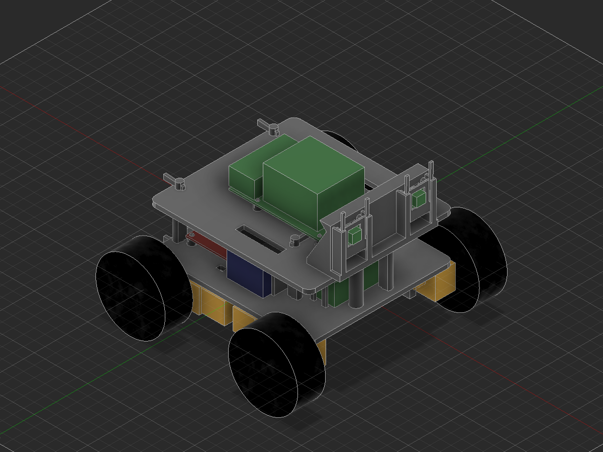

# Ster-Vis test AMR

A small 4WD skid-steer robot for testing Ster-Vis on real hardware. The chassis is
3D printed: the camera mount in ABS, everything else in PLA. It carries yellow
BO (TT) gear motors on their stock 65 mm wheels, a 3S LiPo, a Raspberry Pi 5,
two L298N drivers and two Camera Module 3 on a 60 mm baseline.

**No screws, nuts, straps or zip ties.** Every joint is printed. M2 and M3
threads are too fine to print, so each joint uses a shape that prints well
instead:

| Joint | Printed fastening |
|---|---|
| Decks and pillars | 6 mm pegs on the pillar ends pass through the decks. A tapered wedge pushed through a slot in each peg pulls the deck tight |
| Motors | Headed pins go through the wall and the gearbox, pressed into the wall. The wheel, 2 mm outside the head, stops them walking out |
| L298N boards | Standoffs with a snap peg at each end: the top one clicks through the board and the bottom one through the deck |
| Pi 5 | Snap pegs on the top deck's four bosses |
| Cameras | Each board slides down between rails onto a ledge. A cover presses it against four rear stops, touching only around the board's holes, and two tapered keys wedge the cover in |
| Battery, buck converter | Sprung U-clips that snap through slots in the deck. Their bars bow down and hold the part by spring pressure |

The plain BO motors have no encoders, so this robot can test obstacle avoidance
but cannot give the poses that mapping needs.

## Files

| File | What it is |
|---|---|
| `chassis.py` | The design. A Fusion 360 script that builds the assembly, checks it for interferences and writes everything below. Change dimensions here, not in the STLs. |
| `stl/*.stl` | Print-ready parts, already oriented for the bed |
| `cad/ster-vis-test-amr.f3d` | The Fusion assembly, including stand-in models of the bought parts |
| `cad/assembly/*.stl` | The printed parts where they sit on the robot, for the Gazebo model |
| `render.png` | The picture above |

To regenerate, run `chassis.py` in Fusion (Utilities > Scripts and Add-Ins, or
through the fusion360 MCP bridge). It opens a new design and returns a summary.
An empty `clashes` list means no part overlaps another, printed fasteners
included. Some parts touch on purpose and are not reported: the motor shafts sit
in the wheels, and the clips' bars press on the battery and the buck converter.
An empty `battery_path_blocked_by` means the battery can still slide out.
Building it takes a few minutes.

## Before you print: measure your parts

The bought-part dimensions come from published drawings, not from your parts.
Measure with calipers and compare with the values at the top of `chassis.py`.
The ones that matter most:

- **Motors:** TT clones vary by about 0.5 mm. Check `TT_HOLE_SPACING` (17.5 mm),
  the distance between the two mounting holes centre to centre, and
  `TT_HOLE_BACK` (20.2 mm), the distance from the shaft centre to those holes.
  The pin holes are exact now, with no slots, so these must be right.
- **Camera Module 3:** check the board is 25 × 24 mm, with holes 21 mm apart
  across and 12.5 mm apart vertically, and the top holes 2 mm below the top edge.
- **Board holes:** the L298N's holes (3.0 mm) and the Pi's (2.7 mm). The snap
  pegs are sized to them.

Then print `motor_fit_test_PLA.stl` first. It is one motor wall plus the deck
above it, and takes a few minutes. Pin a motor to it with two
`motor_pin_PLA_x8` pins before you print the full bottom deck.

## Printing

Every part fits a 180 × 180 mm bed. The largest parts are 150 × 136 mm. Each
file holds one part; the `_xN` suffix is how many to print.

| Part | Material | Qty | Notes |
|---|---|---|---|
| `motor_fit_test_PLA` | PLA | 1 | Print first, see above |
| `bottom_deck_PLA` | PLA | 1 | Prints upside down, motor walls up. No supports |
| `top_deck_PLA` | PLA | 1 | Pi bosses and pegs up. No supports |
| `camera_mount_ABS` | ABS | 1 | Foot on the bed. Use an enclosure and a 5 mm brim. No supports |
| `pillar_front_PLA_x2` | PLA | 2 | The two longer ones: they also lock the camera mount's foot. Lying on the flat |
| `pillar_PLA_x4` | PLA | 4 | Lying on the flat |
| `wedge_PLA_x12` | PLA | 12 | Flat |
| `motor_pin_PLA_x8` | PLA | 8 | Lying on the flat. Print a few spares |
| `l298n_standoff_PLA_x8` | PETG or PLA | 8 | Standing. Use a brim: they stand on a small tip |
| `battery_clip_PLA_x2` | PETG or PLA | 2 | Lying on its side |
| `buck_clip_PLA_x2` | PETG or PLA | 2 | Lying on its side |
| `camera_cover_PLA_x2` | PLA | 2 | Front face down, pads up |
| `camera_key_PLA_x4` | PLA | 4 | On its side. Print a few spares |

Suggested settings: 0.2 mm layers, 4 perimeters, 5 top and bottom layers,
30% infill (40% for the camera mount, 100% for the pins, wedges, keys and
clips). The horizontal holes and slots are shaped to print without supports.

Snap-fit parts (standoffs, clips, and the Pi pegs on the top deck) survive more
insertions in PETG than in PLA. They work in PLA, but push them home once and
leave them there.

Holes shrink a little on most printers. If a peg or pin will not go in, open
the hole with a drill bit of the same size rather than forcing it. If a part
fits loosely, scale it up by 1–2% in the slicer.

Keep the L298N heatsinks off the PLA: they sit on the standoffs, and PLA
softens at about 55–60 °C.

## What you still need

Nothing to fasten with. You only need the parts the robot is made of: 4 BO
motors with their wheels, 2 L298N boards, a Raspberry Pi 5 with Active Cooler,
a 5 V 5 A buck converter, a 3S 2200 mAh LiPo, two Camera Module 3 with Pi 5
cables, wire, and a 0.1 µF capacitor per motor.

## Layout

- **Bottom deck:**
  - The battery lies crosswise in the middle, in the gap between the front and rear wheels. It slides out sideways for charging, under the two clips, with nothing to remove. It is sized for a 3S 2200 mAh pack (about 106 × 34 × 26 mm).
  - Both L298Ns are at the rear. The left board drives the left motors and the right board drives the right motors.
  - The motor wires come up through the slots beside each board.
  - The 5 V buck converter is clipped down at the front.
- **Top deck:**
  - The Pi 5 sits with its USB and Ethernet ports facing the rear.
  - The GPIO header is on the right. Run wires down through the slot on that side.
  - The camera mount's foot is locked down by the two front pillars. This gives it a direct path down to the bottom deck.
- **Camera mount:**
  - Both cameras sit in rails on its front face, 60 mm apart.
  - Each ribbon leaves the bottom of its board, passes between the two ledges, back through the window behind it, and runs down over the foot to the Pi.

Main dimensions:

| | |
|---|---|
| Wheelbase | 124 mm |
| Track, wheel centre to wheel centre | 170 mm |
| Overall size | about 189 × 196 × 143 mm, with the camera keys' pull tabs |
| Ground clearance | 17.8 mm, under the motor walls |
| Lens height | about 118 mm above the floor |

## Ster-Vis settings for this robot

- **Lens height:** about 0.12 m, estimated from the stand-in camera model. Measure the real one after assembly.
- **`--scan-min-height`:** set it to about `-0.09`, which is 3 cm above the floor. The default of -0.25 reaches through the floor and reports it as obstacles.
- **`--scan-range-max 2.5`:** matches what a 60 mm baseline can measure.
- **Mount pose:** `--mount` is the left camera's pose on the parent frame. With `base_link` on the floor under the centre of the chassis, it is roughly `--mount 0.08 0.03 0.12 0 0 0`. Measure this too.

## Assembly order

1. Solder wires and a 0.1 µF capacitor across each motor's terminals.
2. **Motors.** Hold each motor against its wall, with the gearbox's locating peg
   (if it faces the wall) in the round hole. Push two pins in from the wheel
   side, through the gearbox and into the wall. They are a press fit in the
   wall: push them until the heads sit on the gearbox.
3. **L298Ns.** Click the eight standoffs into the bottom deck from above, then
   press each board down onto four of them until the pegs click through.
4. **Clips.** Push the two battery clips and the two buck clips down through
   their slots until the barbs click under the deck. Do this before the battery
   goes in: fitting a clip needs its legs to flex inwards. Then slide the buck
   converter and the battery in under their clips.
5. **Pillars and top deck.** Stand the pillars in the bottom deck. On the
   underside, push a wedge through each peg's slot, thin end first, until it is
   tight. Put the top deck on, then the camera mount's foot over the two front
   pegs, and wedge all six on top the same way. The flat on each pillar faces
   the side the wedge goes in from.
6. **Pi 5.** Press it down onto the four pegs until they click.
7. **Cameras.** Slide each camera board down between its rails, lens forward,
   until it sits on the ledges. Slide the cover in on top of it, pads towards
   the board. Push a key down each side, between the cover and the rail's lip,
   thin end first, until it is firm. Do not force it: it wedges tight within a
   few millimetres. Route the ribbons back through the windows.
8. **Wheels.** Push them on last. They should just clear the pin heads.
9. **Calibrate** with `ster-vis calibrate`. Recalibrate whenever a camera key
   or a front pillar wedge has been moved.
