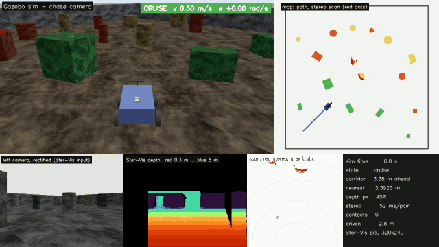

# Gazebo simulations

Two worlds, both driven by Ster-Vis running unmodified from this checkout
(`../../src`):

- **[stereo obstacle avoidance](#stereo-obstacle-avoidance)** — a rover in an
  arena, avoiding obstacles on the stereo laser scan;
- **[warehouse mapping](#warehouse-mapping-from-a-drone)** — a drone flying an
  indoor warehouse, avoiding as it goes and building one point cloud map of
  the building.

The calibration in both is the ideal one built from the cameras' CameraInfo,
since simulated cameras have no lens error; a real rig still needs
`ster-vis calibrate`.

## Stereo obstacle avoidance

A 4-wheel rover carrying a Ster-Vis head (two cameras on a 12 cm bar and a
Raspberry Pi 5) wanders a 12 m arena with 16 obstacles. It sees only through
the stereo pair.



```
left + right camera (Gazebo, 640x480, 10 Hz)
  -> Ster-Vis DepthPipeline, pi5 preset (rectify to 320x240, SGBM, depth)
  -> left-right confidence check
  -> Ster-Vis laser scan (121 beams) -> reactive avoider -> cmd_vel
```

Results and what they showed are in the main README, under
[Testing and validation](../../README.md#gazebo-simulation-obstacle-avoidance).

The world also carries three things the real robot does not:

- a **perfect depth camera** at the left camera, to score every stereo scan
  against the truth. The controller never reads it;
- a **chase camera** behind and above the rover, so the run can be watched.
  Gazebo renders it like the other cameras;
- a **contact sensor** on the chassis, to count collisions (not the wheels).

### Run on Windows (tested)

Needs a conda env with Gazebo Harmonic from [RoboStack](https://robostack.github.io/).
The runs below used an env built from `robostack-jazzy` with
`ros-jazzy-ros-gz-sim`, which brings Gazebo Harmonic 8.6.0, its Python
bindings (`gz.transport13`, `gz.msgs10`) and conda-forge OpenCV with contrib.
That env was built up step by step; in one command it should be:

```powershell
conda create -n ros2gz -c conda-forge -c robostack-jazzy ros-jazzy-ros-gz-sim opencv
```

Then, from this folder:

```powershell
. .\activate-ros2gz.ps1        # conda root: set STER_VIS_CONDA if not C:\ProgramData\miniforge3
.\start-gz.ps1                 # server in the background; makes the world on first run
python avoid.py --show         # 180 s of sim time, live window
.\stop-gz.ps1
```

Gazebo on Windows runs the server only; the GUI is unsupported upstream
([gz-sim#168](https://github.com/gazebosim/gz-sim/issues/168)). The chase
camera in `avoid.py`'s window and video stands in for it.

### Run on Linux (not yet tested)

With Gazebo Harmonic and its Python bindings (`gz-harmonic`,
`python3-gz-transport13`, `python3-gz-msgs10` from packages.osrfoundation.org),
the Gazebo GUI works too:

```bash
python3 make_textures.py && python3 make_world.py
gz sim -r worlds/stereo_avoid.sdf &      # full Gazebo GUI
python3 avoid.py --show
```

### Files

| File | Does |
|---|---|
| `make_textures.py` | noise textures; stereo needs texture to match |
| `make_world.py` | world, obstacles (seed 7), rover with cameras and Pi 5; `worlds/obstacles.json` |
| `avoid.py` | the stereo-to-cmd_vel loop, scoring, live window, video |
| `check_depth.py` | per-pixel depth error on one live frame, by distance band |
| `tune.py` | scores filter settings on frames saved with `avoid.py --record 5` |
| `make_media.py` | a run's video as a GitHub-sized GIF, and H.264 |

Each run writes `run.mp4`, `trajectory.png`, `log.csv` and `summary.json` to
`output/` (or `--out`).

### What is scored

- **missed**: a beam whose true range is under 2 m, reported clear by stereo.
  This is the one that causes crashes.
- **blind**: the same, reported unknown. SGBM cannot match the leftmost
  `num_disparities` columns, about 20% of the left image, because the right
  image does not reach that far.
- **phantom**: stereo reported something under 2 m with nothing real within
  0.5 m behind it.

## Warehouse mapping, from a drone

A quadrotor with the same Ster-Vis head (two cameras on a 12 cm bar, a Pi 5)
flies around a 20 x 12 m warehouse: three runs of pallet racking three levels
high, stock on the shelves, and loose pallets in the aisles. Nothing plans the
flight. The drone avoids what the stereo pair sees, changes level partway
through, and maps whatever it flies past.

```
left + right camera (Gazebo, 640x480, 10 Hz)
  -> Ster-Vis DepthPipeline, pi5 preset (rectify to 320x240, SGBM, depth)
  -> left-right confidence check
  -> Ster-Vis laser scan (121 beams) -> reactive avoider -> cmd_vel
  -> Ster-Vis PointCloudMap (5 cm voxels, pose from the simulator) -> map.ply
```

The pose of each frame comes from the simulator, as it would from a flight
controller's VIO or a motion capture rig: **Ster-Vis maps, it does not
localise.** A second map is built at the same poses from Gazebo's perfect
depth camera, which is the best any mapping could do on that flight; the
stereo map is scored against it, and against the warehouse's true geometry.

```powershell
. .\activate-ros2gz.ps1
.\start-gz.ps1 warehouse.sdf
python fly.py --show           # 300 s of sim time; writes output/warehouse/
.\stop-gz.ps1
```

Results are in the main README, under
[Testing and validation](../../README.md#gazebo-simulation-mapping-a-warehouse-from-a-drone).

### Files

| File | Does |
|---|---|
| `make_warehouse.py` | the building, racking and stock (seed 11), and the drone; `worlds/warehouse.json` holds every box for scoring |
| `fly.py` | the fly-avoid-map loop, the live window, the video, the scoring |
| `score_map.py` | scores a `map.ply`: accuracy against the true boxes, completeness against the ideal-sensor map |
| `render_map.py` | draws a `map.ply`: an oblique view, and a plan against the true boxes |

Each run writes `map.ply`, `map.pgm` + `map.yaml`, `map.json`,
`truth_map.ply`, `map_top_down.png`, `run.mp4`, `log.csv` and `summary.json`
to `output/warehouse/` (or `--out`).

`fly.py --record-pairs DIR` also saves every keyframe pair with its pose and
the calibration, so the flight can be mapped again offline at other settings
with the real command:

```powershell
python fly.py --record-pairs output/warehouse/recording
ster-vis map --replay output/warehouse/recording --calibration output/warehouse/recording/rig.npz `
    --preset pi5 --min-distance 450 --confidence --min-confidence 50 --min-range 0.4 --max-range 4 `
    --keyframe-distance 0 --keyframe-angle 0 --floor-band 0.3 3.5 --out output/warehouse/offline
python score_map.py output/warehouse/offline/map.ply --truth-map output/warehouse/truth_map.ply
```

The keyframes were chosen during the flight, so the rebuild uses all of them
(`--keyframe-distance 0`).

### What is scored

- **accuracy**: distance from each mapped point to the nearest real surface.
  The warehouse is boxes with known poses, so this is exact geometry.
- **completeness**: how much of the ideal-sensor map the stereo map got,
  within 10 cm. Comparing against that map rather than against the whole
  building keeps the question about stereo: a shelf the drone never looked
  behind is missing from both.
- **not in the ideal map**: stereo points with nothing within 10 cm in the
  ideal map - what stereo invented.

The drone is flown by gz's `VelocityControl`, not by rotor thrust: the flight
controller is not what is being tested, and a commanded velocity keeps the
flight repeatable.
